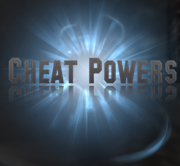

# Cheat Powers

A Skyrim Special Edition mod By Mark E. Kraus.

## About Cheat Powers

This mod adds several powers that work as shortcuts to common console command cheats.

## Powers

* Cheat: Add All Spells - WARNING: This may crash your game depending on what mods you have installed. Adds all spells. Revert to prior save to undo.
* Cheat: Add Daedric Armor - Adds a full set of Daedric Armor.
* Cheat: Add Daedric Weapons - Adds all Daedric weapons and 9,999 Daedric Arrows.
* Cheat: Add 10,000 Septims - Adds 10,000 Septims (gold) to the player.
* Cheat: Toggle AI Detection - Toggles NPCs' ability to detect the player.
* Cheat: Toggle Collision - Toggles collision for the player. This allows the player to walk through walls, doors, floors, etc.
* Cheat: Toggle God Mode - Toggles God Mode on or off.

## Installation

### NMM/Vortex

Download and install with Vortex and the FOMOD installer will take care of the rest.

### Manual

* Extract the 7z file using 7-Zip.
* Copy the extracted `MarkekrausCheatPowers.esl` file to the `data` folder under your Skyrim: Special Edition installation folder.
* Copy the extracted `scripts` folder to the `data` folder under your Skyrim: Special Edition installation folder.
* Enable the plugin using whatever method you usually use.

## User Guide

The cheat powers will be automatically added to your powers list. Magicka > Powers. Equip the desired power, use the power/shout button.

## Compatibility

This mod should be compatible with everything and should not require any patches.

## Warning: Not Lore-Friendly and Cheating

This mod is definitely not lore-friendly.

This mod is made for cheating.
